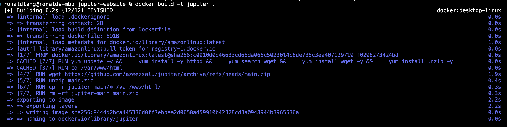
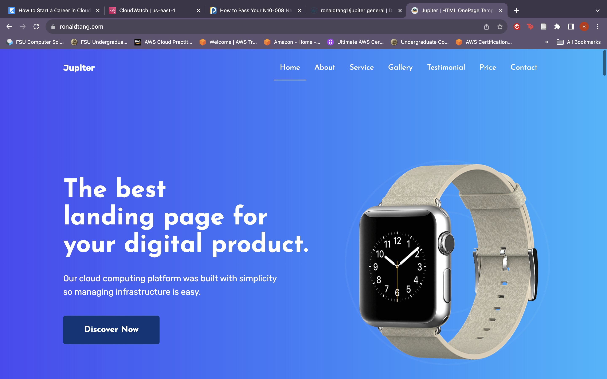

# Docker Project - Deploy Static Web App 

## Ronald Tang

### Project 1 Requirements:

*Three parts:*

1. create a docker file to build container
2. create a VPC with security groups, route tables, NAT gateways, and an application load balancer
3. create a ecs cluster, task definition, and service to use container

#### Assignment Screenshots:

| Screenshot of Docker File Running | Screenshot of Static Web App |
| ---------- | ---------- |
|  |  | 